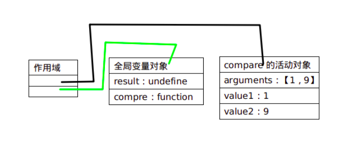
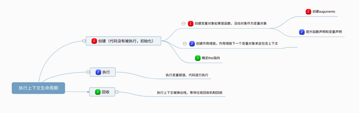

## 一、执行上下文

函数每一次调用就会产生一个新的执行上线文环境，它被放在执行上下文栈。变量或函数的上下文决定了它们可以访问哪些数据，以及它们的行为。执行上下文栈会在其所有代码执行完毕把执行上下文弹出，将控制权返回给执行上下文。ECMAScript代码执行流就是通过执行上下文栈进行控制。

## 二、执行上下文类型

1.全局执行上下文是最外层的上下文，在浏览中全局上下文就是window对象。JavaScript代码运行起来会首先进入该环境,栈底永远都是全局上下文，而栈顶就是当前正在执行的上下文。
2.函数执行上下文
3.eval执行上下文

## 三、三个属性

1.**变量对象(variable object, VO)**，每个上下文都有一个变量对象，这个上下文内定义的所有变量和函数都存在这个对象上，但是无法通过代码访问这个变量对象，但在后台会用到它。
   **在函数上下文中，使用活动对象 (activation object, AO) 来表示变量对象。**
   ```js
   function compare(value1,value2){
        if(value1<value2){
            return -1;
        }else if(value1>value2){
            return 1;
        }else{
            return 0;
        }
    }
    let result = compare(1,9)
   ```
   
   
2.**作用域链**，在执行上下文代码执行的时候，创建作用域链，作用域链决定执行上下文代码在访问变量和函数的顺序，权利。

3.**this**

## 四、执行上下文生命周期

创建-> 执行 -> 回收
1.创建
（1）创建作**用域链**（Scope Chain）。
（2）创建**变量对象**（函数的形参、函数声明、变量声明）。
（3）求”**this**“的值。
2.执行
代码执行
3.回收
执行上下文出栈被垃圾回收机制进行回收。


## 五、增强作用域链

1.try/catch语句的catch块
2.with语句
catch语句会创建新的变量对象，with语句会向作用域前段添加指定的对象。

## 六、变量声明

1.var:函数作用域，声明会被拿到函数或作用域顶部，这个现象叫提升（hoisting）

2.let:块级作用域即为{声明内}，if，while，function都是块，它不能在同一作用域声明多次，而var会被忽略。let也会被提升，但是约束了变量提升。

 暂时性死区：当程序的控制流程在新的作用域（`module` `function` 或 `block` 作用域）进行实例化时，在此作用域中用let/const声明的变量会先在作用域中被创建出来，但因此时还未进行词法绑定，所以是不能被访问的，如果访问就会抛出错误。因此，在这运行流程进入作用域创建变量，到变量可以被访问之间的这一段时间，就称之为暂时死区（ temporal dead zone），简称 **TDZ**）。

3.const:不能重新复制，所以必须初始化，暗示变量的值是单一类型且不可修改。可以用Object.freeze()让整个对象都不能修改。

声明变量会自动添加到最接近的上下文，如果未经声明就初始化，将自动添加到全局上下文
```js
 console.log(a)//undefined
 console.log(b)//报错，暂时性死区
 var a = 3;
 let b = 4;`
 ```
 
 ```js
 let a = 'outside';
if(true) {
   console.log(a);//Uncaught ReferenceError: a is not defined
    let a = "inside";
}//a报错没有定义，所以let有变量提升，但是由于死区我们无法在声明前访问这个变量
 
 ```
 
 七、标识符查找
 --
 当上下文要读取或写入一个标识符时，必须确定标识符是什么，搜索开始与作用域链最前端，如果没有找到变量名，继续沿着作用域链搜索。（作用域链中对象可能原型链，因此搜索可能涉及原型链），最后一直搜索到作用域链底部（全局上下文）
 ```js
 let name = 'a'
 function getName(){
  let name = 'b'
  {
  let name = 'c'
  return name
  }
 }
 console.log(getName());//c,块级作用域不会更改搜索流程，但是可以增加额外层次
 ```
 标识符查找也有代价，需要后台处理，访问最近的局部变量更快，因为不用切换作用域搜索。
